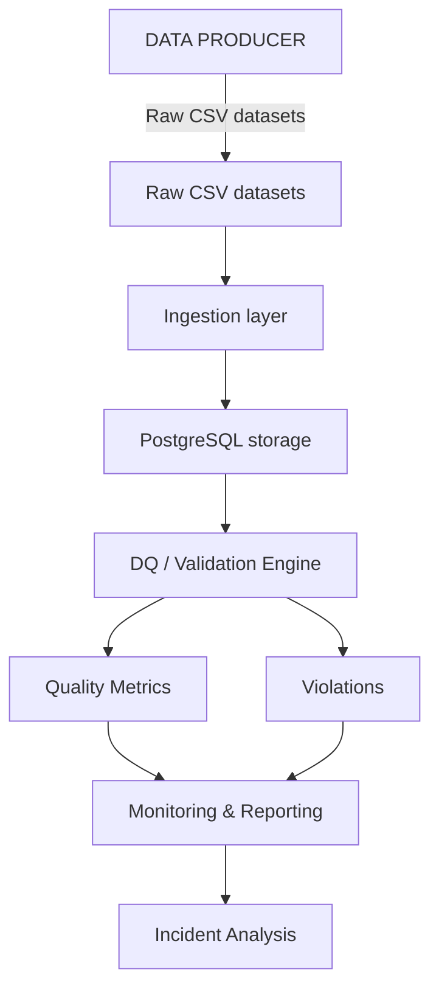

# Data Quality Architecture Documentation

--- 

## 1. Overall Architecture

--- 

## 2. Raw CSV Datasets

- **Description**: Represents the external source system.
- **Sources in a Real Company**:
  - Application database
  - API
  - SFTP
  - Another company's system
  - Object storage
  - Transactional database

--- 

## 3. Ingestion Layer

- **Responsibility**: 
  - Read source
  - Basic parsing
  - Load data

--- 

## 4. PostgreSQL

- **Purpose**: 
  - Serves as operational metadata and test environment
  - Contains:
    - Business data
    - Data Quality (DQ) metadata

--- 

## 5. Validation Engine

- **Description**: The core of the project.

--- 

## 6. DQ Metrics

- **Purpose**: Measure data quality.

--- 

## 7. Monitoring

- **Description**: 
  - Moves the project from Data QA towards DataOps
  - **Monitored Aspects**:
    - Freshness
    - Pipeline duration
    - Row-count anomaly
    - Quality degradation

--- 

## 8. Incidents

- **Description**: Intentional introduction of failures for testing and validation.